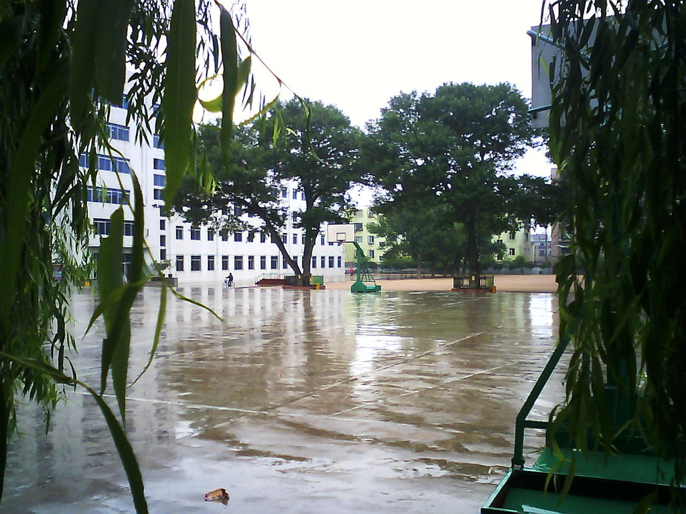

其实自己也算是个整理狂？当然仅限于电子设备上的文件管理。在过去的小一年里，把大部分的内容都尽量有序化，其实大概也不会再看，但是规规整整的看着也舒坦一点。

## 图库整理

这个基本上是一直都在做的事情。得益于 iCloud 的图库功能，但是毕竟我 17 年才开始用苹果产品，这之前的照片什么的信息有很多欠缺，而且铺放的位置也乱七八糟的。

### 没有智能手机的时候

那时候没有智能手机，所有的留存基本上都是通过初中的一个可拍照的 mp4，家里的 DV 机留下的。当时也没有电脑，因此遗失了很多东西。

还好的地方在于，保存了一小部分的照片，分辨率现在看起来简直是低到惊人。比如：

分辨率真的高。。

然后通过自己疯狂的想象力，在 mac 上填充好地理位置信息，和大概的时间。具体的时间实在是记不起来了。

### 后来

有很多照片都是在微信上拍了直接发出去的，会遗失很多信息，比如地理位置等等，而且没有保存原图，这些的好处就是不用再想时间了，根据上下文总是能猜到的。

### 现在

的话，照片都会开着地理位置等全部信息，留好所有的原图，不为别的，收藏&整理需要。

## 笔记整理

其实这才是一个看起来很简单的任务——从初中的记事本，到后来的印象笔记、小米备忘录、华为便签、mweb、ulysses、苹果备忘录（庆幸自己没有用过有道等等）等，有一些不再用了，需要整合到一起。有一些是大型文件，需要使用 markdown 文库去整理。因此现在基本上是用苹果的备忘录 + ulysses 去做统一的规范。

### 华为便签

当时是支持导出功能的，因此导出到 txt 再导入到小米备忘录，还是很方便的。

### 小米便签

很可惜在我不使用它的时候导出功能被砍掉了，但是还好，有人写了个脚本可以从小米网页版导出格式化的文件夹，然后导入到苹果备忘录里。

### 记事本

的内容包括很多，主要是小时候写的剧本，就让它以文件形式在里面存着吧..

### markdown

最初年少不懂事，写 markdown 用国产的 mweb 写，但是用了用还是很难用的。。在饿了么的时候，周报日报都写在里面，是我今天整理的时候才发现的一直没有迁移过来。

Ulysses 是个很好的编辑器，只是跟苹果一个风格，我甚至找不到文件的创建时间。。也好，手动排序吧。

## 文件整理

这是一个最复杂的最复杂的东西了。。

大学时候把资料整理到了微云、百度云盘、oneDrive 上面，但是还是有好多资料都在本地啊。

现在的存储设备有群晖、iCloud，不打算把文件存在国内的任何云盘上了。

> 关于为什么要放弃国内云盘，其实国内很多的服务我都不打算用了。
>
> 1. 云盘的审查机制相当于：我存储在云服务商的内容版权是属于云服务商的，他有权查看解密或封禁任何内容，换句话说，自己的私密文件在云盘上都是有备份的。
> 2. 云盘的本质不以存储为目的。比如某度云，如果我没有会员并且在里面存储了些东西，那么我想取回的时间成本是高到离谱的。
> 3. 功能缺失。比如说的微云上的文件时间。
> 4. 功能泛滥。并不需要云盘去做的功能一个个吹的天花乱坠。比如相册备份、通讯录备份、相册识别等等。

iCloud: 各种文档类型的文件

群晖：大型媒体文件等

因此现在群晖基本没存什么东西..

一番整理，终于整理的差不多了。

有一个很严肃的问题就是文件的创建修改时间。fuck 的腾讯微云同步的时候不会把时间安排上，搞了一上午发现 oneDrive 上其实是有这个功能的。

对于一些是在没办法的，那就 `touch -mt` 好了。

## 通讯录整理

从初中到现在存了近 500 个联系人，打算整理一下。整理大体规则：

1. 看第一眼 3 秒钟内想不起来是谁的，删除
2. 明知一辈子都不会再联系的人，删除
3. 与支付宝对比，名字对不上号的，删除
4. 与微信对比，明显不是一个人的，删除

然后我之前好像是跟朋友网、新浪微博同步过信息，但是现在这个功能好像都没有了。哭 😭

## 结语

越写越不想写…
